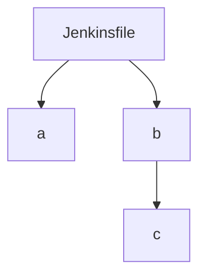

# jenkinsdiagrams

This script converts a folder of Jenkins files into a visual representation.

Whilst there are [Jenkins plugins to view pipeline graphs](https://plugins.jenkins.io/pipeline-graph-view/), you have to
enter a pipeline first.
If you have many pipelines and don't know the top-level/entrypoint pipelines, you might like this tool.
Visualise in the terminal, as textual diagrams, or render with your IDE/GitHub/Docusaurus etc.

# Inputs

Specify a path to your project.
`Jenkinsfile.*` and any files ending with `.jenkinsfile` will be scanned

# Options

With `.jenkinsfile`s, the file isn't enough to state whether they are used as a top-level pipeline in Jenkins (vs being
called by a higher-level pipeline).

To create a more accurate visual representation of your pipelines, add this line to the top of your Jenkins files which
are called directly from the Jenkins UI:

```groovy
// jenkins2diagram:toplevel
```

# Supported outputs

Here's a few options - I'm considering:

- Mermaid diagram
    - Renders in GitHub .md previews
    - Renders in Docusaurus (a static website tool)
- ~Ascii art~
    - Renders anywhere
- ~Image files~

I'll focus on mermaid first.
I think the app will return text to stdout, which can be piped `>` by the user into a file if they wish.

# Developing a POC (1/2)

This app is quite domain / keyword specific, so for this POC I aim to:

- [x] Get the basic file reading, pipeline mappings, etc. correct with simplified syntax:

```
# Jenkinsfile 
// jenkins2diagram:toplevel
build job: 'a'
build job: 'b'

// a.jenkinsfile

// b.jenkinsfile
build job: 'c'

// c.jenkinsfile
```

Should produce:



## Notes on GraphViz DOT and Mermaid

Note: To kickstart generating the tree, I used [anytree](https://github.com/c0fec0de/anytree).
It can export to a Python dictionary, JSON, or "Dot" format.
The DOT language is a grammar for [Graphviz](https://graphviz.org/doc/info/lang.html).

- IntelliJ
    - recognised Mermaid in my code block, offered to install the plugin, and rendered correctly. Mermaid plays
      nice with GitHub and Docusaurus, as is already mentioned
    - making graph.dot let the IDE suggest a plugin install. A sample graph renders nicely, and copy to clipboard/save
      to file work great
- GitHub markdown rendering
    - [Including graphviz graphs is a little indirect](https://github.com/TLmaK0/gravizo) (some html tags and custom
      marks seem to be necessary)
        -
      Apparently [Graphviz is in C, and Mermaid is written in JS](https://forum.graphviz.org/t/github-adding-support-for-mermaid-diagrams/998)
        - and mermaid is a little prettier
- Docusaurus
    - I only see documentation on Mermaid support - nothing for Graphviz
- Converting Graphviz DOT to Mermaid
    - Kroki: A server that renders a bunch of different textual diagrams to images

Overall, I should probably aim to add a Mermaid exporter to `anytree`. There's no issues/PRs for it so far.
`anytree`'s `dotexporter.py` is ~ 400 lines, but more than half of it is examples.
I'll try a basic version in this POC first.

The mermaid tree generation is working nicely.
Seeing that anytree can import/export trees as Python dictionaries helped me see I can move to a minimal dependency
version, hopefully without too much challenge. That can happen later.
I will try to raise a basic PR for a Mermaid exporter now.
https://github.com/c0fec0de/anytree/pull/215 is the basic PR, with nice diagrams in the description!

# Developing a POC (2/3)

- [x] Change to support more proper syntax
    - It seems about right for now
- [x] Be more flexible with matches (`build(job: '...',...)` vs `build job:'...'`, etc.))
    - Writing some unit tests for this

# Developing a POC (3/3)

## Create a CLI

As a user, I would like to:

- (Option) `--path PATH` to scan.
    - Default: current directory.
    - Example: `jenkisdiagram --path ~/IdeaProjects/monorepo`.
- (Option) `--folders NAME` to scan, in addition to root.
    - Default: all folders.
        - If it's too slow for large repositories, can change default to scan only root and `pipelines`.
    - Example: `jenkinsdiagram --folders infra/jenkins/pipelines-old --folders infra/jenkins/pipelines-new`

[Typer](https://typer.tiangolo.com/) is awesome

Calling the app with `--help` will list the (all optional) arguments:

```shell
python .\main.py --help
```

Optional args, exceptions, etc. are all nicely formatted.

Arg parsing is done and the CLI feels nice. I want to publish to homebrew before 

# Pushing to HomeBrew

[Packaging a Python CLI tool for Homebrew](https://til.simonwillison.net/homebrew/packaging-python-cli-for-homebrew)

`pip install -r requirements.txt`

PyPi publish first, then brew!
https://medium.com/@joel.barmettler/how-to-upload-your-python-package-to-pypi-65edc5fe9c56
https://www.jetbrains.com/help/pycharm/creating-and-running-setup-py.html


# Other nice things

- [x] CLI could output to SVG
    - https://github.com/mermaid-js/mermaid-cli
      - png and pdf work fine; svg needs some manual config setup (noted in CLI)
      - user installs with `npm i -g`
      - and it's an official repo from the mermaid team
    - ~~https://github.com/superj80820/mermaid-js-converter~~
      - sends out diagram to a URL