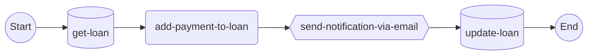

# *Idempotency, Transactions and Retries*

When designing the workflows order of steps the matter. Imagine I design the `pay loan` workflow this way.



I first retrieve the loan entity from my application database, add the payment (recalculate the loan cashflows, or whatever), **notify the user that the payment has been recorded and then... update the loan state in the database.** What happens if the update command in the database fails? When interacting with *services* or the *database* you are dealing with not deterministic processes. Input will not always return the same output (networking issues, permission removals, API keys expirations, etc...) ***everything can fail at every time.***

A good approach, at least as I see it, is to (conceptually) split the workflow in two parts the first part is in charge of gathering information from the database and services (`GET` operations), modifying the application entities, and finally updating the database state ***as a ACID transaction.*** Finally, other operations like sending notifications can ocurr. If the notify operation fails can be retried for X number of times...

This is one of the use cases for this library, `UseCaseRegistry`s can go throw the workflow capturing a set of write operations that will be executed as an `ACID transaction` later in the workflow.

```python
from decimal import Decimal
from uuid import UUID

from usecase_registry import UseCaseRegistry

registry = UseCaseRegistry[str](max_length=10)


def pay_loan(
    user_id: UUID,
    loan_id: UUID,
    payment: Decimal,
    write_ops_registry: UseCaseRegistry[str],
) -> None:
    assert write_ops_registry.is_empty()

    user_loan: Loan = database.get_loan(loan_id)

    user_loan.add_payment(payment)

    database.update_loan(loan_id, user_loan, write_ops_registry)

    assert len(write_ops_registry.get_state()) == 1

    database.commit_write_ops(write_ops_registry)

    assert write_ops_registry.is_empty()

    email_service.send_notification(user_id, "Your loan payment has been registered.")
    return

```

**But why?** The reason is that you may want to extend your workflow with different number of operations. So, it's super important to register all your write transaction and then commit all of them `ACID`ly. Otherwise, there's a risk your database ends up inconsistent. Let's say business wants to add a counter for users to track the number of payments they have done. That can be easily implemented as follows.

```python
from decimal import Decimal
from uuid import UUID

from usecase_registry import UseCaseRegistry

registry = UseCaseRegistry[str](max_length=10)


def pay_loan(
    user_id: UUID,
    loan_id: UUID,
    payment: Decimal,
    write_ops_registry: UseCaseRegistry[str],
) -> None:
    assert write_ops_registry.is_empty()
    user: User = database.get_user(user_id)
    user_loan: Loan = database.get_loan(loan_id)

    user_loan.add_payment(payment)
    user.number_payments += 1

    database.update_user(user_id, user, write_ops_registry)
    database.update_loan(loan_id, user_loan, write_ops_registry)

    assert len(write_ops_registry.get_state()) == 2

    database.commit_write_ops(write_ops_registry) # this can fail.

    assert write_ops_registry.is_empty()

    email_service.send_notification(user_id, "Your loan payment has been registered.")
    return

```

Much more safety than:

```python
from decimal import Decimal
from uuid import UUID

from usecase_registry import UseCaseRegistry

registry = UseCaseRegistry[str](max_length=10)


def pay_loan(
    user_id: UUID,
    loan_id: UUID,
    payment: Decimal,
    # write_ops_registry: UseCaseRegistry[str],
) -> None:
    user: User = database.get_user(user_id)
    user_loan: Loan = database.get_loan(loan_id)

    user_loan.add_payment(payment)
    user.number_payments += 1

    database.update_user(user_id, user) # this can fails.
    database.update_loan(loan_id, user_loan) # this can also fail.

    email_service.send_notification(user_id, "Your loan payment has been registered.")
    return

```